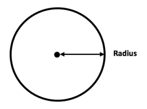
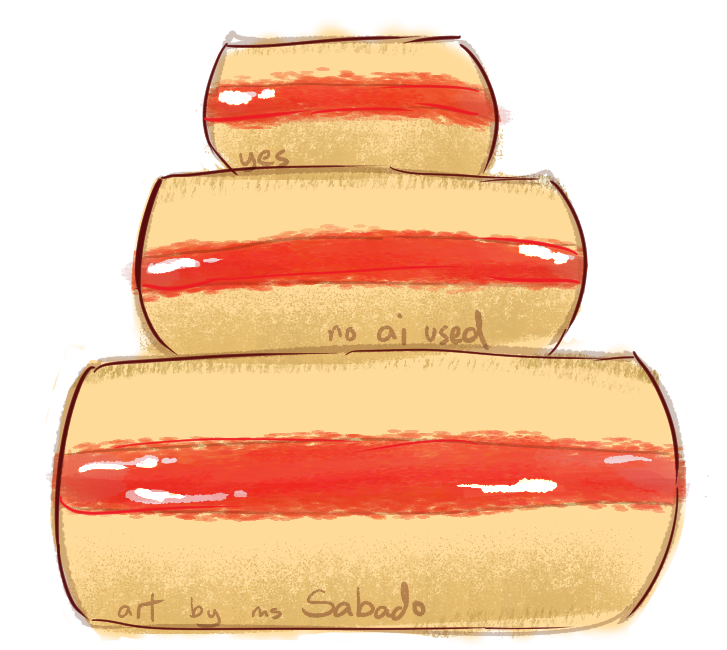

# [E1] - Karen's Bakeshop - STACK by Janie Lane Sabado

## Background
 

Realizing her talents in baking, Ms. Karen has decided to open up a new Bakeshop. It is very famous, especially among students that Ms. Karen cannot keep up with all the orders of Cake. So she has asked Ms. Janie if she could create a Cake AI Assistant that would help in building up cakes while Ms. Karen focuses on the baking process. Ms. Janie was more than willing to help and so she decided to code this Cake AI Assistant not just because Ms. Karen is her friend but also because Ms. Karen offered to create her wedding cake in the future.

 

HOWEVER! Ms. Janie was suddenly whisked away to a surprise holiday getaway with her boyfriend! And so she had to leave immediately, the program left unfinished as Ms. Janie ponders if her boyfriend will propose on this trip. It is now up to you to help, finish the program not just to help Ms. Karen in her Bakeshop but also to help relieve Ms. Janie as she feels bad for leaving the program unfinished.

 

## Objectives
 

- Create the pushLayer function which will insert a new cakelayer into the CAKE stack based on the following rules:
    - Radius constraint: Only three layers of the same radius are allowed.
        - The helper function countRadius is used to check this condition.
    - Stacking rule: A new layer must have a radius that is smaller than the current top layer’s radius.
    - Stack operations: Use the existing push, pop, and topfunctions to manipulate the stack
- Create the countRadius function which will count how many layers share the same radius and then return the count to the calling function.
    - The original order of the stack must be preserved.
    - Traverse the stack using only the defined stack operations (push, pop, top).
    - Return the count of how many layers share the same radius as the target
 

## Function Definitions
 

1. The function countRadius will do the following:

    - Accept the parameter radius and a pointer to the stack *C.
    - Traverse the stack using only the defined operations (push, pop, top).
    - Count how many layers share the same radius as the target.
    - Return the total count of layers with the given radius.
 

2. The function pushLayer will do the following:
    - Accept the parameters CAKE *C and CakeLayer Layer.
    - If the stack is full, print:<br>
    &emsp;`"Error: Cake is Fully Stacked!"` <br> and terminate the function.
    - If there are already 3 layers of that radius, print:<br>
&emsp;`"Error: already 3 layers of this radius %d.\n"` <br>and terminate the function.
    - If the new radius is larger, print:<br>
&emsp;`"Error: Radius %d is not smaller than top radius %d.\n"`<br>and terminate the function.
    - If the new radius is smaller, push the new layer and print:<br>
&emsp;`"Pushed %s (radius %d).\n"`
3. Use the helper function countRadius to determine how many layers of the same radius already exist.
 

## NOTE
 

- Radius. a straight line from the center of the circle to the edge<br>
<br>
- A typical cake looks like this
 


 


 

---

### Sample Output 1
```
Enter your choice: 1

Pushed Vanilla (radius 7).

Cake of the Day:

   Sponge:       |*******     Vanilla        *******|
```
### Sample Output 2
```
Enter your choice: 2
Pushed Vanilla (radius 7).
Pushed Chocolate (radius 7).
Pushed Vanilla (radius 7).

Cake of the Day:

   Sponge:       |*******     Vanilla        *******|
  Filling:       |*******     Chocolate      *******|
   Sponge:       |*******     Vanilla        *******|
```
### Sample Output 3
```
Enter your choice: 3
Pushed Vanilla (radius 7).
Pushed Mango (radius 7).
Pushed Vanilla (radius 7).
Pushed Vanilla (radius 5).
Pushed Mango (radius 5).
Pushed Vanilla (radius 5).

Cake of the Day:

   Sponge:         |*****     Vanilla        *****|
  Filling:         |*****     Mango          *****|
   Sponge:         |*****     Vanilla        *****|
   Sponge:       |*******     Vanilla        *******|
  Filling:       |*******     Mango          *******|
   Sponge:       |*******     Vanilla  
```
