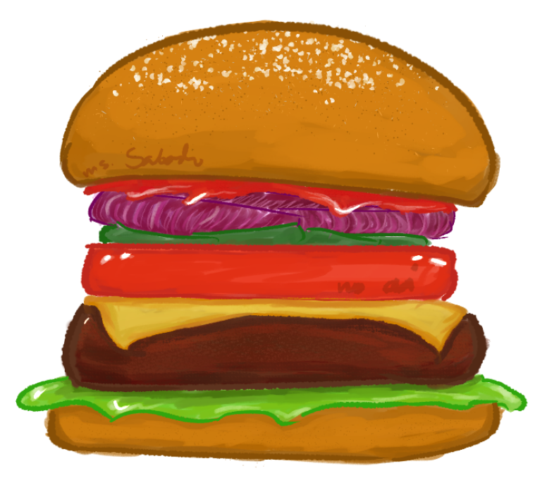

# [E2] - Prime's Burgerjoint - STACK by Janie Lane Sabado

## Background
 

Realizing his talents in cooking, Sir Prime has decided to open up a new Burger Joint. It is very famous, especially among students that Sir Prime cannot keep up with all different orders of burgers. So he has asked Ms. Janie if she could create a Burger AI Assistant that would help in building up burgers while Sir Prime focuses on the cooking the patties. Ms. Janie was more than willing to help and so she decided to code this Burger AI Assistant not just because Sir Prime is her friend but also because Sir Prime promised lifetime burgers for Ms. Janie.

 

HOWEVER! Ms. Janie was suddenly whisked away to a surprise holiday getaway with her boyfriend! And so she had to leave immediately, the program left unfinished as Ms. Janie ponders if her boyfriend will propose on this trip. It is now up to you to help, finish the program not just to help Sir Prime in his Burger Joint but also to help relieve Ms. Janie as she feels bad for leaving the program unfinished.

 

## Objectives
 

1. Create the **makeBurger** function which will push new ingredients from an ingredientList into the BurgerStack based on the following rules:
    - Empty list constraint: If the ingredient list is empty, terminate the function.
    - Protein constraint: Pork patties are not allowed. If encountered, terminate the function.
    - Cheese rule: Melted cheese must only be placed directly on top of a protein.
    - Stack operations: Use the existing pushBurger, popBurger, and burgTop functions to manipulate the stack
2. In other words, you are tasked to build up a burger given that you have a list of ingredients and a pointer to a burger stack.
 

## Function Definitions
 

1. The function makeBurger will do the following:

    - Accept the parameters BurgerStack *B and IngredientList List.
    - If the ingredient list is empty, print:<br>
&emsp;`"\nError: No ingredients to stack a burger"`<br> and terminate the function
    - If a pork patty is encountered, print:<br>
&emsp;`"\nError: Pork is not on the menu"`<br>and terminate the function
    - If the ingredient is melted cheese, check the current top of the burger stack:
        - If the top is a protein, push the cheese and print:<br>
&emsp;`"\nSuccess: Pushed %s"`<br>
        - Otherwise, print:<br>
&emsp;`"\nError: Melted cheese should only be on top of protein"`
        - Note that the function is not terminated and continues
    - For all other ingredients, push them onto the stack and print:<br>
&emsp;`"\nSuccess: Pushed %s"`
 

## ADT Definitions
- BurgerStack - acts like a stack data structure
- IngredientList - acts like a list data structure
 

 

## Operations
```
void initBurgerStack(BurgerStack *B); 
// equivalent to initialize stack - makes the stack empty

void pushBurger(BurgerStack *B, Ingredient Layer); 
//equivalent to push - inserts element based on top

void popBurger(BurgerStack *B);
//equivalent to pop - deletes element based on top

Ingredient burgTop(BurgerStack B);
//equivalent to top - returns the element based on top

void display(BurgerStack B,String burg);

int isBurgerEmpty(BurgerStack B); 
//equivalent to isEmpty - is the stack empty

int isBurgerFull(BurgerStack B);  
//equivalent to isFull - is the stack empty

 ```

 

## NOTE
Refer to the main.c to see the ingredients to be put into the burger

 

A typical burger looks like this



---

### Sample Output 1
```
Enter your choice: 1

Error: No ingredients to stack a burger

Function makeBurger terminated
```
### Sample Output 2
```
Enter your choice: 2

Success: Pushed Sesame Bun
Success: Pushed Mayo
Error: Pork is not on the menu

Function makeBurger terminated
```
### Sample Output 3
```
Enter your choice: 3

Success: Pushed Sesame Bun
Success: Pushed Mayo
Success: Pushed Lettuce
Error: Melted cheese should only be on top of protein
Success: Pushed Onion
Success: Pushed Tomato
Success: Pushed Sesame Bun


Burger of the Day: Veg Burger with no Cheese

       |****  Sesame Bun     ****|
       |****  Tomato         ****|
       |****  Onion          ****|
       |****  Lettuce        ****|
       |****  Mayo           ****|
       |****  Sesame Bun     ****|
```